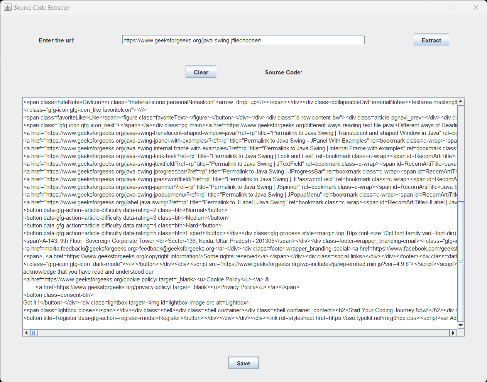

# SOURCE CODE EXTRACTOR

This is a simple java swing project.The main purpose of this project is to extract source code from any website that has source code visible.

## Run ExtractSourcecode
``` bash
java ExtractSourcecode.java
```

## Author
- [@Kingask-dark](https://github.com/Kingask-dark)


## Screenshots





